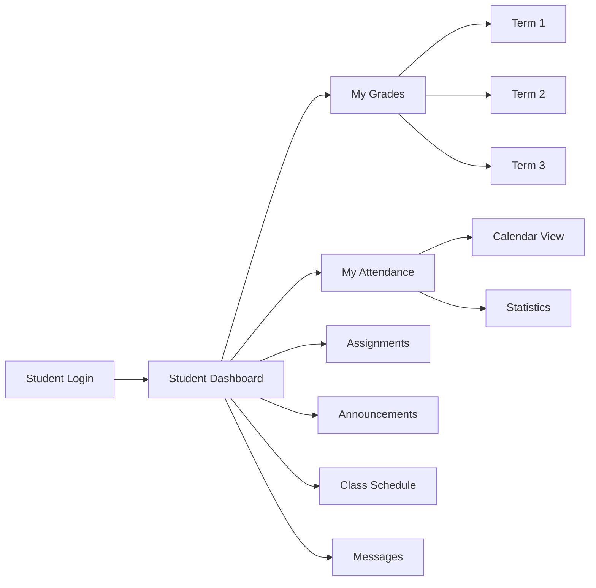
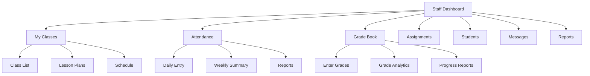
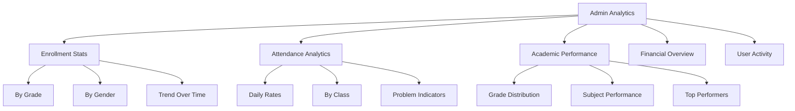
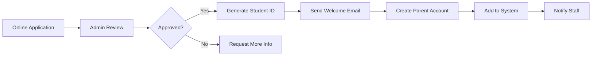
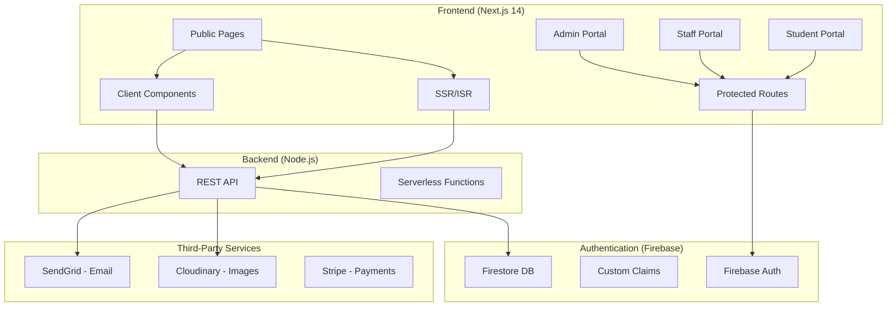

# NCA School Website - Comprehensive Improvement Plan

## Project Overview

**Project:** Nyabihu Christian Academy (NCA) School Website  
**Location:** Nyabihu District, Rwanda  
**Current Tech Stack:** Next.js 14, Node.js/Express, MongoDB, Firebase, TailwindCSS, Framer Motion  
**School Levels:** Nursery and Primary (P1–P6)

---

## Executive Summary

The NCA school website is a well-structured full-stack application with a public-facing website, admin dashboard, staff portal, and student portal. This document provides comprehensive improvement recommendations across 8 key areas, identifies system weaknesses, and proposes architectural enhancements.

---

## Current System Analysis

### Strengths ✅
- Complete public website with all essential pages
- Role-based authentication system (Admin, Teacher, Parent)
- CRUD operations for students, teachers, announcements, events, gallery
- Firebase integration for auth and storage
- Responsive design with TailwindCSS
- Framer Motion animations
- Security middleware (Helmet, CORS, Rate limiting)
- JWT authentication with password hashing
- Academic records and attendance tracking in database schema

### Weaknesses ⚠️ (Detailed Below)
1. **Architecture:** Mixed Firebase + MongoDB approach creates complexity
2. **Authentication:** Dual auth systems (Firebase + JWT) cause inconsistency
3. **Portals:** Incomplete implementation with placeholder features
4. **Admin Dashboard:** Basic stats, no real-time analytics
5. **Performance:** Large unoptimized images, no caching strategy
6. **Security:** Firebase config exposed, weak demo mode tokens
7. **Automation:** No automated workflows
8. **Modern Features:** Missing PWA, offline support, push notifications

---

# Part 1: User Experience (UI/UX) Improvements

## 1.1 Visual Design Enhancements

### Color Palette Refinement
- **Current:** Primary blue (#0052cc), Gold (#ffb800)
- **Recommendation:** Add a modern color system with semantic colors
  - Success: #10B981 (green for confirmations)
  - Warning: #F59E0B (amber for alerts)
  - Error: #EF4444 (red for errors)
  - Info: #3B82F6 (blue for information)
  - Create CSS variables for consistent theming

### Typography Improvements
- **Current:** Poppins + Montserrat
- **Enhancement:**
  ```css
  /* Add more font weights */
  --font-light: 300;
  --font-regular: 400;
  --font-medium: 500;
  --font-semibold: 600;
  --font-bold: 700;
  --font-extrabold: 800;
  
  /* Add line-height variables */
  --leading-tight: 1.25;
  --leading-normal: 1.5;
  --leading-relaxed: 1.625;
  ```

### Micro-interactions
Add subtle animations for better user feedback:
- Button hover: Scale 1.02 + shadow increase
- Card hover: Lift effect with shadow
- Form focus: Border color transition + label float
- Loading states: Skeleton screens instead of spinners
- Success feedback: Checkmark animation
- Error feedback: Shake animation

### Dark Mode Support
Implement system-preference dark mode:
```javascript
// tailwind.config.js
darkMode: 'class', // or 'media'
```

### Glassmorphism Effects
Add modern glass effect for cards and modals:
```css
.glass {
  background: rgba(255, 255, 255, 0.1);
  backdrop-filter: blur(10px);
  border: 1px solid rgba(255, 255, 255, 0.2);
}
```

## 1.2 Navigation & Layout Improvements

### Sticky Navigation
- Add scroll-aware navbar that changes background on scroll
- Implement scroll-to-top button for long pages
- Add breadcrumb navigation for nested pages

### Mobile Navigation Enhancements
- Slide-in drawer from left (hamburger menu)
- Touch-friendly tap targets (min 44px)
- Swipe gestures for gallery/carousel
- Bottom navigation bar for mobile admin

### Footer Improvements
- Multi-column layout for better organization
- Quick links with icons
- Social media integration
- Newsletter signup form
- School map integration

## 1.3 Page-Specific UX Improvements

### Homepage
- [ ] Add video background option for hero section
- [ ] Implement parallax scrolling effects
- [ ] Add testimonial carousel with student/parent quotes
- [ ] Create interactive campus map
- [ ] Add virtual tour button with 360° view placeholder

### Admissions Page
- [ ] Multi-step application form wizard
- [ ] Progress indicator for application
- [ ] Document upload with drag-and-drop
- [ ] Fee calculator based on grade selection
- [ ] FAQ accordion

### Gallery Page
- [ ] Masonry grid layout
- [ ] Lightbox with keyboard navigation
- [ ] Filter by category/date
- [ ] Lazy loading with blur-up effect
- [ ] Download individual images option

### Contact Page
- [ ] Interactive map with school location
- [ ] Department-specific contact forms
- [ ] Office hours display
- [ ] Emergency contact prominent display

---

# Part 2: New Features

## 2.1 Student Features

### Student Dashboard (`/student-portal/dashboard`)
- [ ] Current grades display with GPA calculation
- [ ] Upcoming assignments/ homework list
- [ ] Attendance calendar view
- [ ] Announcements feed
- [ ] Class schedule
- [ ] School calendar integration

### Academic Features
- [ ] Online report cards (termly)
- [ ] Grade history with trend charts
- [ ] Assignment submission status
- [ ] Teacher feedback viewing
- [ ] Study resources/ materials download

### Communication
- [ ] Inbox for messages from teachers
- [ ] Parent notification system
- [ ] Announcements archive

## 2.2 Staff/Teacher Features

### Teacher Dashboard (`/staff-portal/dashboard`)
- [ ] Daily attendance summary
- [ ] Class schedule with period times
- [ ] Pending tasks/assignments
- [ ] Quick grade entry
- [ ] Student alerts (low attendance, failing grades)
- [ ] Announcements composer

### Teaching Tools
- [ ] Grade book with bulk entry
- [ ] Assignment creator
- [ ] Attendance tracker (daily/weekly)
- [ ] Class roster with parent contacts
- [ ] Lesson plan templates
- [ ] Resource library upload

### Communication
- [ ] Bulk messaging to parents
- [ ] Individual student notes
- [ ] Meeting scheduler with other teachers

## 2.3 Parent Features

### Parent Portal (`/parent-portal`)
- [ ] View all children's profiles
- [ ] Individual child dashboards
- [ ] Payment history and fee status
- [ ] Attendance reports
- [ ] Academic progress reports
- [ ] Teacher communication
- [ ] Event/RSVP functionality
- [ ] Report concern form

---

# Part 3: Student & Staff Portal Features

## 3.1 Student Portal Improvements

### Current State
- Login page exists but dashboard incomplete
- Basic placeholder UI

### Recommended Features



### Implementation Checklist

| Feature | Priority | Description |
|---------|----------|-------------|
| Grade Viewer | HIGH | Display current grades with subject breakdown |
| Attendance Tracker | HIGH | Calendar view showing present/absent/late |
| Assignment List | HIGH | List of pending and completed assignments |
| Announcement Feed | MEDIUM | School announcements specific to student |
| Schedule Display | MEDIUM | Weekly class timetable |
| Message Inbox | LOW | Communication with teachers |

## 3.2 Staff Portal Improvements

### Current State
- Dashboard exists but mostly placeholder
- Links to non-existent pages

### Recommended Features



### Implementation Checklist

| Feature | Priority | Description |
|---------|----------|-------------|
| Class Management | HIGH | View and manage assigned classes |
| Attendance Entry | HIGH | Daily attendance taking interface |
| Grade Entry | HIGH | Bulk grade entry by class/subject |
| Student Directory | HIGH | Search and filter students |
| Assignment Creator | MEDIUM | Create and manage homework |
| Reports Generator | MEDIUM | Class performance reports |
| Message System | LOW | Parent communication |

---

# Part 4: Admin Dashboard Enhancements

## 4.1 Dashboard Overview

### Current Stats to Real Metrics
Replace static "—" values with real-time data:
- Total Students (with breakdown by grade)
- Active Teachers (by department)
- Today's Attendance %
- Pending Announcements
- Upcoming Events (next 7 days)

### Analytics Dashboard



## 4.2 Enhanced Management Features

### Student Management (`/admin/students`)
- [ ] Advanced filters (grade, gender, status, admission date)
- [ ] Bulk import/export (CSV)
- [ ] Student profile with full academic history
- [ ] Parent linking and management
- [ ] Document storage (birth certificate, photos)
- [ ] Transfer/withdrawal handling
- [ ] Alumni tracking

### Teacher Management (`/admin/teachers`)
- [ ] Teacher profiles with qualifications
- [ ] Class assignments
- [ ] Schedule management
- [ ] Performance metrics
- [ ] Leave management
- [ ] Salary information (optional)

### Academic Management
- [ ] Subject/Class assignment
- [ ] Term/semester management
- [ ] Academic calendar
- [ ] Exam schedule management
- [ ] Grading system configuration

### Financial Management (New)
- [ ] Fee structure setup
- [ ] Invoice generation
- [ ] Payment tracking
- [ ] Payment reminders
- [ ] Financial reports
- [ ] Expense tracking

## 4.3 System Settings (`/admin/settings`)

### Current Features
- Basic site settings

### Recommended Additions
- [ ] School information management
- [ ] Academic year configuration
- [ ] Grade levels setup
- [ ] Subject management
- [ ] Fee configuration
- [ ] Email/SMS templates
- [ ] Backup management
- [ ] Audit logs

---

# Part 5: Performance Optimization

## 5.1 Image Optimization

### Current Issues
- Large PNG files (Front.png: 2.5MB, basket.png: 2.3MB)
- No image compression
- No lazy loading implementation
- Unoptimized image formats

### Solutions

```javascript
// next.config.js improvements
const nextConfig = {
  images: {
    formats: ['image/avif', 'image/webp'],
    deviceSizes: [640, 750, 828, 1080, 1200, 1920, 2048],
    imageSizes: [16, 32, 48, 64, 96, 128, 256, 384],
    minimumCacheTTL: 60 * 60 * 24 * 30, // 30 days
  },
}
```

### Implementation Steps
1. Convert images to WebP/AVIF format
2. Implement responsive images with `srcset`
3. Add blur-up placeholders
4. Use Cloudinary or similar for transformations
5. Compress all static images
6. Implement lazy loading for below-fold images

## 5.2 Code Splitting & Bundle Optimization

### Current Issues
- Large bundle size potential
- No component lazy loading
- All routes loaded at once

### Solutions
```javascript
// Dynamic imports for heavy components
import dynamic from 'next/dynamic'

const GalleryGrid = dynamic(() => import('@components/GalleryGrid'), {
  loading: () => <Skeleton />,
  ssr: false
})

const AdminStats = dynamic(() => import('@components/AdminStats'), {
  loading: () => <StatsSkeleton />
})
```

## 5.3 Caching Strategy

### Implementations
- [ ] Static page caching (ISR - Incremental Static Regeneration)
- [ ] API response caching
- [ ] Browser caching headers
- [ ] Service worker for offline support
- [ ] Redis for session caching (production)

## 5.4 Database Optimization

### Current Issues
- Limited indexing
- No query optimization
- N+1 query potential

### Solutions
```javascript
// Add compound indexes
studentSchema.index({ grade: 1, isActive: 1 });
studentSchema.index({ admissionDate: -1 });
studentSchema.index({ 'attendance.date': -1 });

// Use select for specific fields
const students = await Student.find({ grade: 'P3' })
  .select('firstName lastName grade attendance')
  .populate('parent', 'email phone');
```

---

# Part 6: Security Best Practices

## 6.1 Authentication & Authorization

### Current Issues
- Firebase config exposed in source
- Demo tokens hardcoded in backend
- Dual auth systems (Firebase + JWT)
- Security code stored but not enforced properly

### Recommended Solutions

#### A. Unified Authentication System
**Option 1: Firebase Auth Only (Recommended)**
- Move all auth to Firebase
- Use custom claims for roles
- Implement ID token verification on backend
- Remove JWT from MongoDB backend

**Option 2: JWT Only (Simpler for Custom)**
- Remove Firebase auth dependency
- Use secure JWT with refresh tokens
- Implement OAuth providers directly in Node.js

#### B. Security Enhancements
```javascript
// JWT Configuration
const jwtOptions = {
  algorithm: 'RS256', // Use asymmetric encryption
  expiresIn: '15m',   // Short access token
  issuer: 'nca-school',
  audience: 'nca-users'
}

// Refresh token rotation
// Store refresh tokens in database
// Implement token blacklisting for logout
```

### Role-Based Access Control (RBAC)
```javascript
// Define permission levels
const PERMISSIONS = {
  admin: ['*'],
  teacher: ['read:students', 'write:grades', 'read:attendance', 'write:attendance'],
  parent: ['read:own_children', 'read:grades', 'read:attendance'],
  student: ['read:own_profile', 'read:own_grades', 'read:own_attendance']
}

// Middleware implementation
const checkPermission = (...allowedRoles) => {
  return (req, res, next) => {
    if (!allowedRoles.includes(req.user.role)) {
      return res.status(403).json({ message: 'Access denied' });
    }
    next();
  };
};
```

## 6.2 Firebase Security

### Current Issues
- Firebase config exposed in `firebase.js`
- No Firestore security rules visible
- Storage rules not configured

### Recommendations

#### Environment Variables
```javascript
// Use environment variables ONLY
const firebaseConfig = {
  apiKey: process.env.NEXT_PUBLIC_FIREBASE_API_KEY,
  authDomain: process.env.NEXT_PUBLIC_FIREBASE_AUTH_DOMAIN,
  projectId: process.env.NEXT_PUBLIC_FIREBASE_PROJECT_ID,
  // ... other config from env
}
```

#### Firestore Security Rules
```javascript
rules_version = '2';
service cloud.firestore {
  match /databases/{database}/documents {
    
    // Users can read their own profile
    match /users/{userId} {
      allow read: if request.auth != null && request.auth.uid == userId;
      allow write: if request.auth != null && request.auth.uid == userId 
                   && request.resource.data.role == 'parent';
    }
    
    // Admins have full access
    match /{document=**} {
      allow read, write: if request.auth != null 
                         && get(/databases/$(database)/documents/users/$(request.auth.uid)).data.role == 'admin';
    }
  }
}
```

#### Firebase Storage Rules
```javascript
rules_version = '2';
service firebase.storage {
  match /b/{bucket}/o {
    // Only authenticated admins can upload
    match /{allPaths=**} {
      allow read: if true;
      allow write: if request.auth != null 
                   && request.resource.size < 5 * 1024 * 1024 // 5MB max
                   && request.resource.contentType.matches('image/.*');
    }
  }
}
```

## 6.3 API Security

### Rate Limiting Improvements
```javascript
// Different limits for different endpoints
const authLimiter = rateLimit({
  windowMs: 15 * 60 * 1000,
  max: 5, // Strict for login
  message: 'Too many login attempts'
});

const apiLimiter = rateLimit({
  windowMs: 15 * 60 * 1000,
  max: 100, // Standard for API
});

const uploadLimiter = rateLimit({
  windowMs: 60 * 1000,
  max: 10, // Limited for uploads
});
```

### Input Validation & Sanitization
- Use Zod or Joi for schema validation
- Implement CSRF protection
- Add request ID for tracing
- Sanitize all user inputs
- Implement SQL injection prevention (Mongoose handles this)

## 6.4 Data Protection

### Encryption
```javascript
// Encrypt sensitive fields
const crypto = require('crypto');

const encryptField = (text) => {
  const iv = crypto.randomBytes(16);
  const key = crypto.scryptSync(process.env.ENCRYPTION_KEY, 'salt', 32);
  const cipher = crypto.createCipheriv('aes-256-cbc', key, iv);
  let encrypted = cipher.update(text, 'utf8', 'hex');
  encrypted += cipher.final('hex');
  return { iv: iv.toString('hex'), data: encrypted };
};
```

### Audit Logging
```javascript
// Log all admin actions
const auditLog = async (action, userId, details) => {
  await Audit.create({
    action,
    userId,
    details,
    ip: req.ip,
    timestamp: new Date()
  });
};
```

---

# Part 7: Automation Systems

## 7.1 Automated Workflows

### A. Student Enrollment Flow


### B. Attendance Automation
- [ ] Daily attendance reminder to teachers
- [ ] Auto-mark absent after X hours
- [ ] Parent notification for absence
- [ ] Monthly attendance reports generation

### C. Grade & Report Automation
- [ ] Auto-calculate term averages
- [ ] Generate PDF report cards
- [ ] Email reports to parents
- [ ] Archive historical records

### D. Fee Management Automation
- [ ] Generate invoices at term start
- [ ] Payment reminder emails
- [ ] Late fee calculation
- [ ] Receipt generation

### E. Announcement System
- [ ] Schedule announcements for future
- [ ] Target-specific audiences (grade, parents, teachers)
- [ ] Push notifications to app users
- [ ] Email digest to parents

## 7.2 Communication Automation

### Email Templates
```javascript
const emailTemplates = {
  welcome: {
    subject: 'Welcome to NYABIHU CHRISTIAN ACADEMY',
    template: 'welcome-email.html'
  },
  attendanceAlert: {
    subject: 'Attendance Alert - {studentName}',
    template: 'attendance-alert.html'
  },
  feeReminder: {
    subject: 'Fee Payment Reminder - {term}',
    template: 'fee-reminder.html'
  },
  reportCard: {
    subject: 'Term Report Card - {studentName}',
    template: 'report-card.html'
  },
  eventNotification: {
    subject: 'Upcoming Event: {eventName}',
    template: 'event-notification.html'
  }
};
```

### SMS Integration (Future)
- Integrate with Twilio or Africa's Talking
- SMS alerts for emergencies
- SMS fee reminders
- SMS event notifications

## 7.3 Backups & Maintenance

### Automated Backups
- [ ] Daily database backups to cloud storage
- [ ] Weekly full system backups
- [ ] Backup rotation (keep 30 days)
- [ ] Backup verification tests

### Monitoring
- [ ] Uptime monitoring (UptimeRobot)
- [ ] Error tracking (Sentry)
- [ ] Performance monitoring (New Relic)
- [ ] Log aggregation

---

# Part 8: Modern Web Features

## 8.1 Progressive Web App (PWA)

### Implementation
```javascript
// next-pwa configuration
const withPWA = require('next-pwa')({
  dest: 'public',
  register: true,
  skipWaiting: true,
  disable: process.env.NODE_ENV === 'development',
  runtimeCaching: [
    {
      urlPattern: /^https.*/,
      handler: 'NetworkFirst',
      options: {
        cacheName: 'offlineCache',
        expiration: {
          maxEntries: 200,
          maxAgeSeconds: 24 * 60 * 60 // 24 hours
        }
      }
    }
  ]
})
```

### PWA Features
- [ ] Installable on mobile/desktop
- [ ] Offline functionality
- [ ] Push notifications
- [ ] App-like experience
- [ ] Background sync
- [ ] Splash screen

## 8.2 Real-time Features

### Implementation with Firebase
```javascript
// Real-time listeners
import { onSnapshot, doc } from 'firebase/firestore';

// Real-time announcements
const subscribeToAnnouncements = (callback) => {
  return onSnapshot(
    collection(db, 'announcements'),
    where('status', '==', 'published'),
    orderBy('createdAt', 'desc'),
    (snapshot) => {
      const announcements = snapshot.docs.map(doc => ({
        id: doc.id,
        ...doc.data()
      }));
      callback(announcements);
    }
  );
};
```

### Real-time Capabilities
- [ ] Live announcements
- [ ] Real-time attendance updates
- [ ] Chat/messaging system
- [ ] Live notifications
- [ ] Online status indicators

## 8.3 Advanced Features

### A. Online Payment Integration
- [ ] Stripe/PayPal integration
- [ ] Mobile money (MTN, Airtel) - Rwanda specific
- [ ] Payment gateway

### B. Virtual Learning (LMS)
- [ ] Course content upload
- [ ] Video lessons
- [ ] Quizzes and assessments
- [ ] Progress tracking
- [ ] Discussion forums

### C. AI Features
- [ ] Chatbot improvements (already exists)
- [ ] AI-powered grade predictions
- [ ] Attendance anomaly detection
- [ ] Personalized learning recommendations

### D. Mobile App (React Native/Expo)
- [ ] Dedicated mobile app
- [ ] Push notifications
- [ ] Offline-first architecture
- [ ] Camera integration for document upload

### E. Analytics Dashboard
- [ ] Enrollment trends
- [ ] Attendance heatmaps
- [ ] Grade distributions
- [ ] Financial reports
- [ ] Export to PDF/Excel

---

# System Weaknesses & Architectural Improvements

## Critical Weaknesses

### 1. Dual Authentication System
**Problem:** System uses both Firebase Auth and JWT/MongoDB auth, causing:
- User confusion
- Data inconsistency
- Security gaps
- Maintenance overhead

**Solution:** Consolidate to ONE auth system
- **Recommended:** Firebase Auth with Custom Claims
- **Alternative:** JWT-only with refresh tokens

### 2. Incomplete Portal Implementations
**Problem:** 
- Staff portal links to non-existent pages
- Student portal dashboard incomplete
- No parent portal

**Solution:** 
- Implement all linked pages or remove links
- Build complete portal experience
- Add dedicated parent portal

### 3. Image Size Issues
**Problem:**
- Front.png: 2.5MB
- basket.png: 2.3MB
- nca logo.png: 900KB

**Solution:**
- Convert to WebP (80%+ reduction)
- Implement lazy loading
- Use CDN for image delivery

### 4. Hardcoded Demo Tokens
**Problem:** Backend has hardcoded demo tokens that bypass authentication

**Solution:** Remove all demo tokens, use proper authentication only

### 5. No Error Boundaries
**Problem:** React errors can crash entire pages

**Solution:** Add error boundaries and fallback UI

### 6. No Testing Infrastructure
**Problem:** Limited tests for frontend

**Solution:** Add Jest, React Testing Library, E2E tests with Playwright

---

## Recommended Architecture Improvements

### New Architecture Diagram



### Technology Recommendations

| Component | Current | Recommended | Reason |
|-----------|---------|--------------|--------|
| Auth | Firebase + JWT | Firebase Only | Simplification, security |
| Database | MongoDB | Keep or Firebase Firestore | Flexible, scalable |
| Images | Local/CDN | Cloudinary | Optimization, CDN |
| Email | Nodemailer | SendGrid | Deliverability |
| Hosting | Vercel + Render | Vercel (full) | Simplicity |
| Monitoring | None | Sentry | Error tracking |
| Analytics | None | Plausible/GA4 | Privacy-focused |

### Migration Path

1. **Phase 1: Security Hardening**
   - Fix exposed Firebase config
   - Remove demo tokens
   - Implement proper RBAC

2. **Phase 2: Portal Completion**
   - Build complete student portal
   - Build complete staff portal
   - Add parent portal

3. **Phase 3: Performance**
   - Image optimization
   - Code splitting
   - Caching strategy

4. **Phase 4: Modern Features**
   - PWA implementation
   - Real-time features
   - Payment integration

---

# Implementation Priority Matrix

## Must Fix (Security/Critical)
- [ ] Remove hardcoded demo tokens
- [ ] Fix Firebase config exposure
- [ ] Implement proper error handling
- [ ] Add input validation on all forms

## Should Have (Core Features)
- [ ] Complete student portal dashboard
- [ ] Complete staff portal dashboard
- [ ] Image optimization
- [ ] Add loading skeletons

## Nice to Have (Enhancements)
- [ ] PWA implementation
- [ ] Real-time notifications
- [ ] Payment integration
- [ ] Dark mode

## Future Vision (Long-term)
- [ ] Mobile app
- [ ] LMS integration
- [ ] AI features
- [ ] Virtual learning

---

# Conclusion

The NCA school website is a solid foundation with good code structure. The main areas for improvement are:

1. **Security:** Consolidate authentication, remove hardcoded tokens
2. **Completeness:** Finish portal implementations
3. **Performance:** Optimize images and add caching
4. **Modern Features:** Add PWA, real-time features

Following this roadmap will transform the system into a modern, secure, and fully-featured school management platform.

---

*Document Version: 1.0*  
*Last Updated: 2026-03-12*  
*Prepared for: NYABIHU CHRISTIAN ACADEMY*
